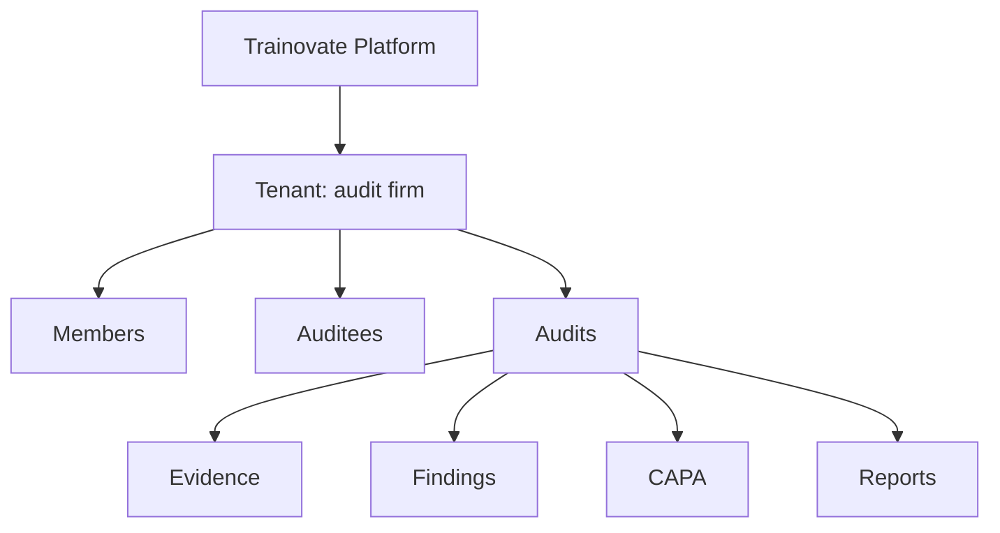

# Tenancy and RBAC

The tenant is the hard application data boundary.

## Claims

Tenant users carry Firebase custom claims with `role` and `tenantId`. Platform superadmins carry `platform: true` and do not receive blanket client-side write permissions.

Claims are set only by server-side functions.

## Roles

- Tenant Admin manages members, invites, branding, auditees, templates, and tenant-wide audits.
- Lead Auditor creates audits, assigns teams, captures records, manages findings, and signs reports.
- Auditor captures evidence and findings only on assigned audits.
- AI photo analysis is generated server-side and readable only to tenant members assigned to the audit.
- AI RAG retrieval runs server-side and may retrieve only documents within the active tenant and auditee namespace.
- Client Viewer reads only scoped auditee findings and corrective actions.

## Non-Negotiable Invariants

- Client code never chooses its own tenant.
- Firestore rules enforce tenant membership even when a query is malformed.
- Historical records preserve `createdBy` and change-log attribution.
- Deactivation removes access without deleting attribution.
